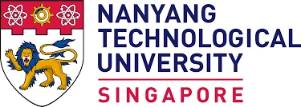
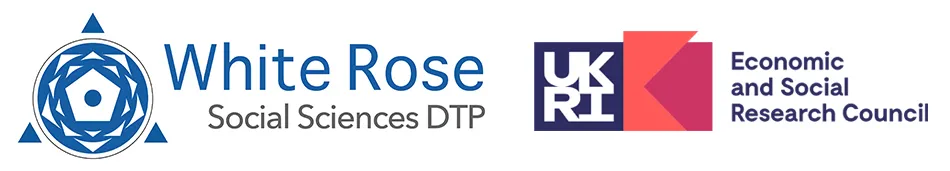
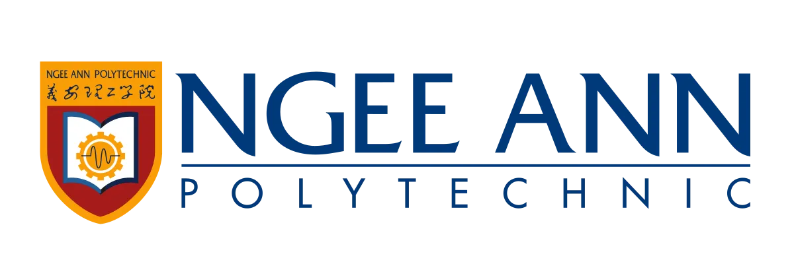

::: {.pagehead}
[About]{.kicker}

# A researcher who's following the machines. {.unlisted}
:::

## Who I am

::: {.split}
::: {}
I'm a PhD researcher in Psychology at the [University of Hull](https://www.hull.ac.uk/), funded by the [White Rose Doctoral Training Partnership](https://wrdtp.ac.uk/). My work sits at the intersection of human cognition and artificial intelligence --- how our minds adapt, resist and evolve as AI becomes harder to tell apart from reality.

I'm also broadly interested in the wider social and philosophical fallout of an AI-saturated world --- from AI-generated misinformation to what "real" and "fake" even mean anymore. Most of that thinking ends up on the [blog](blog/index.qmd).
:::

::: {.plate}
{alt="Ho Chin Wei"}
:::
:::

## My research

::: {.cardgrid}
::: {.tile}
[PhD · 2025 —]{.tile-kicker}
[Joint action with an artificial partner]{.tile-title}

Does the social Inhibition of Return (sIOR) effect survive when the other actor in the task is an artificial rather than a person?
:::

::: {.tile}
[MSc · 2024 Distinction]{.tile-kicker}
[The ethics of seeing]{.tile-title}

How people judge the authenticity of AI-altered images, and how context moderates what we find acceptable. 700+ participants; multilevel SEM.
:::
:::

## Before Hull

I completed my BSc in Psychology at Nanyang Technological University in Singapore, where I was twice named an NTU President Research Scholar through the Undergraduate Research Experience on Campus (URECA) programme, leading two independent year-long research projects along the way. My full academic history is on my [CV](CV.qmd).

::: {.logos}
{alt="Nanyang Technological University"}
{alt="White Rose Doctoral Training Partnership"}
{alt="Ngee Ann Polytechnic"}
:::

## Where to next

::: {.cardgrid .three}
[[Blog]{.tile-kicker}[Thoughts, in longer form]{.tile-title}[Ponderings about everything under the sun →]{.tile-note}](blog/index.qmd){.tile}

[[Projects]{.tile-kicker}[Reproducible analyses]{.tile-title}[Bayesian workflows and live R pipelines →]{.tile-note}](projects/index.qmd){.tile}

[[CV]{.tile-kicker}[My full record]{.tile-title}[Education, publications, funding, skills →]{.tile-note}](CV.qmd){.tile}
:::
