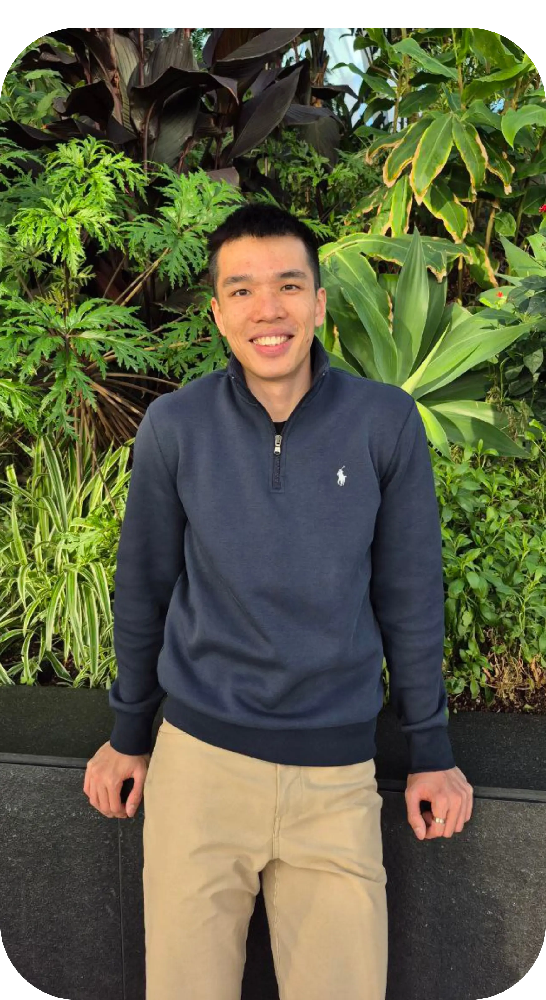

::::: {#hero}

::: {#hero-field aria-hidden="true"}
:::
::: {#hero-veil}
:::

:::: {#hero-inner}

::: {.hero-plate}
{.hero-portrait alt="Ho Chin Wei"}
:::

::: {.hero-copy}
# Hello! I'm Chin Wei.

[I study what shifts in cognition when the other actor in the task is an artificial one.]{.hero-lede}

PhD researcher in psychology at the University of Hull, funded by the White Rose DTP. How people extend --- and withdraw --- agency toward artificial agents, and what that does to social cognition.

::: {.hero-social}
[](https://www.linkedin.com/in/hochinwei/){.icon-btn title="LinkedIn"}
[](https://www.researchgate.net/profile/Chin-Wei-Ho?ev=hdr_xprf){.icon-btn title="ResearchGate"}
[](https://github.com/Hochinwei){.icon-btn title="GitHub"}
[](https://orcid.org/my-orcid?orcid=0009-0003-4688-805X){.icon-btn title="ORCID"}
[](https://x.com/HoChinWei_){.icon-btn title="X"}
:::
:::

::::
:::::

::: {.strands}
::: {}
## Research

Social inhibition of return in human--agent joint action, and how people judge the authenticity of AI-altered images. Preregistered experiments, SEM, Bayesian estimation.

[Learn more about me →](about.qmd)
:::

::: {}
## Writing

Notes on an AI-saturated world --- misinformation, authenticity, and what "real" is doing in that sentence. Written for people outside the discipline as much as inside it.

[Read my blog →](blog/index.qmd)
:::

::: {}
## Projects

Reproducible R write-ups: Bayesian workflows in *brms*, live data pipelines, and the occasional argument settled with a Bayes factor.

[See my projects →](projects/index.qmd)
:::
:::

